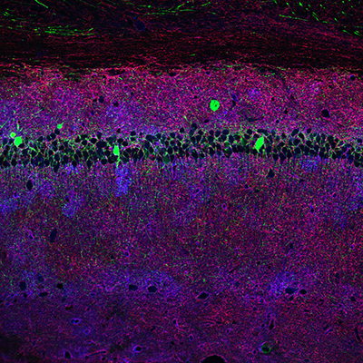
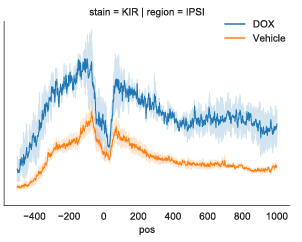

# Python Image Profiler
## Code to generate and analyse linear profiles from multiple images

This repository contains a python package to parse, visualize, and quantify the data generated from measuring signal intensity along lines drawn across microscopy images.  

This code can be used on images like this: 

To generate plots like this: 

The notebooks in this respository demonstrate the use of the package to quantify pixel intesity across the layers of the mouse hippocampus stained for multiple proteins of interest. 

Brief description of workflow:

1) Run the measureProfile.ijm macro in imageJ and manually draw lines across the regions that you wish to profile. The macro will generate spreadsheets containing pixel intensity values for each line drawn for each channel of each image.  

2) Follow the workflow outlined in the notebooks on the csv files generated from the previous step. 

Note: The code contained here is a work in progress. Regular expressions to relate image name to image and subject metadata are currently hard coded.  

